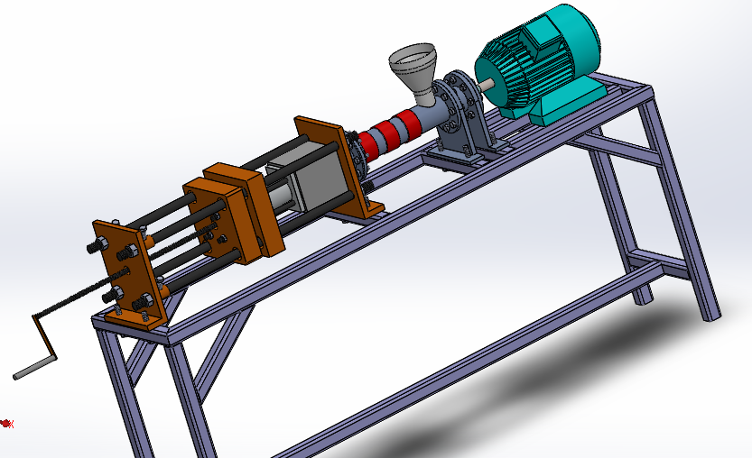
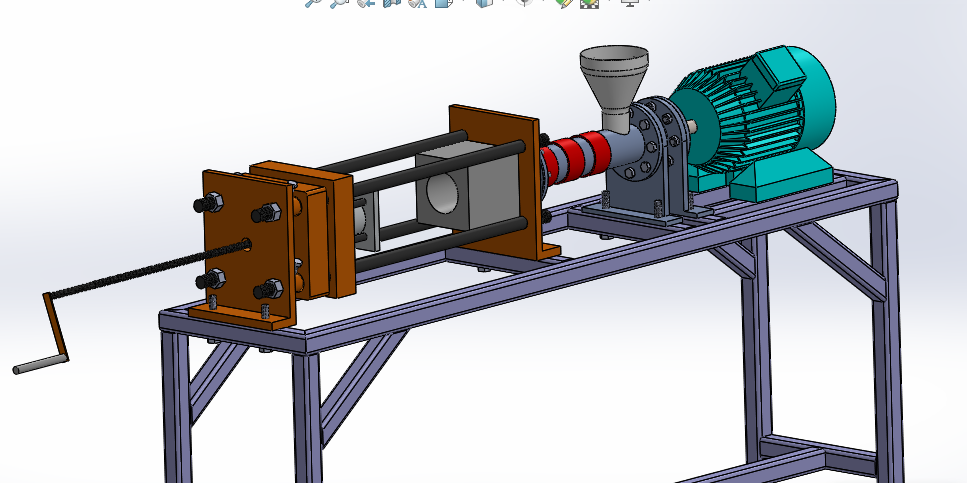
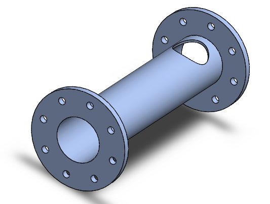
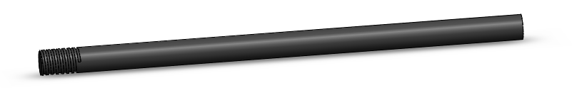
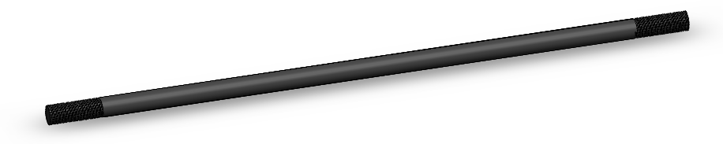
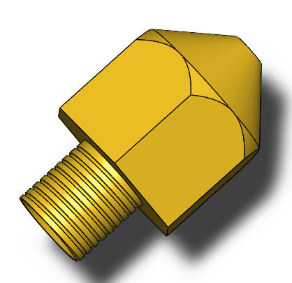
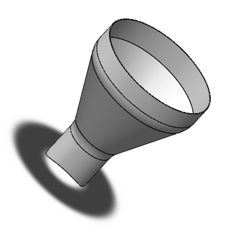
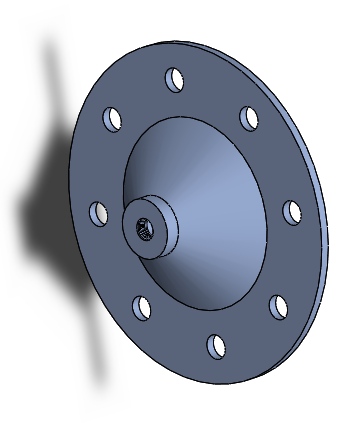
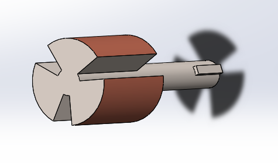
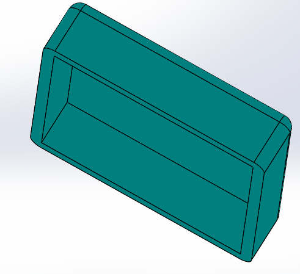

# Plastic-Injection-Moulding.

##  The primary Aim of a project is to reuse plastic to make useful product.

## Assembly

## Parts 

### 1. Structure Frame

### 2. Bearing housing and Cover

### 3. Casing

 

### 4. Moving Plate

### 5. fix  Plate

### 6. Rear Plate

### 7. Fixed Mould

### 8. Mould Cavity

### 9. Screwd Handle and Rods

### 10. Screw conveyor

### 11. Nozzle

### 12. hopper

### 13. Band Heater

### 14. Barrel

### 15. Motor Front Cover

### 16. Motor Back Cover

### 16. Motor Rotor

### 16. Motor Stator

### 16. Motor Stand

### 16. Motor Cover

### 16. Moulded Product

